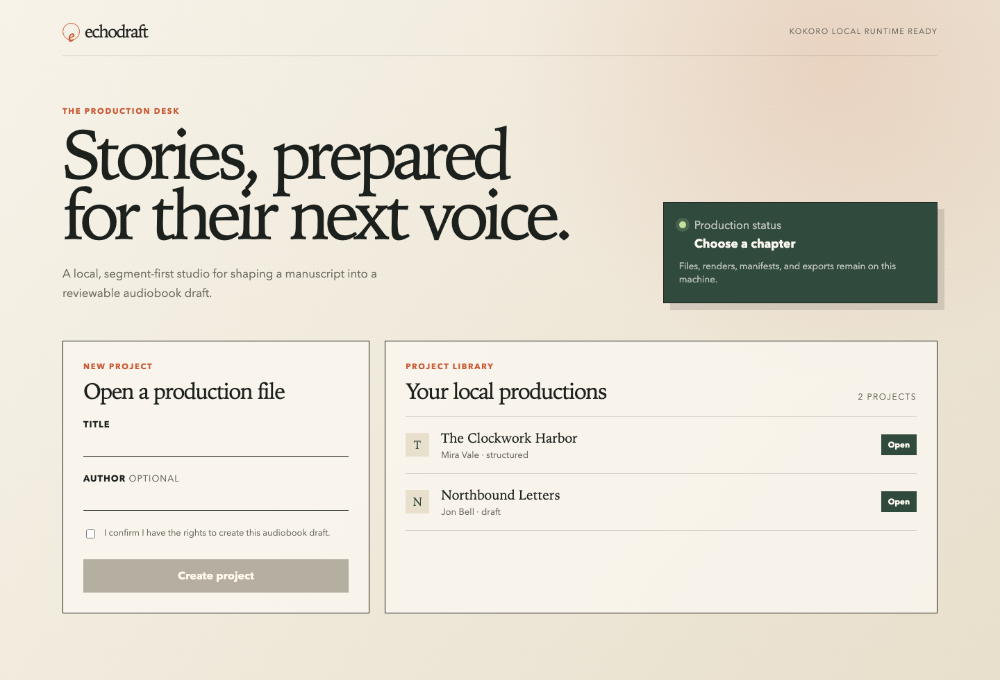
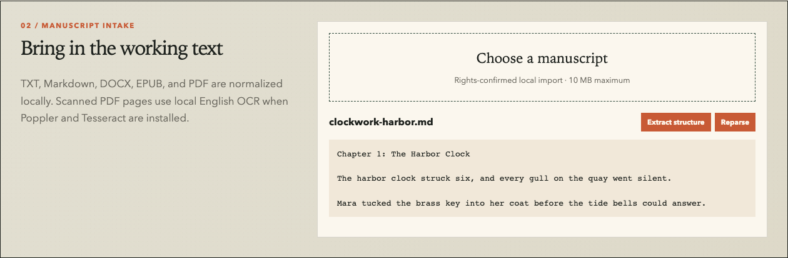
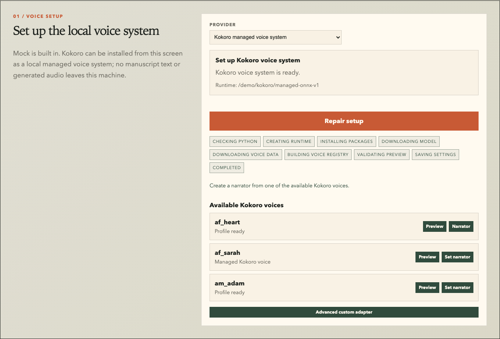
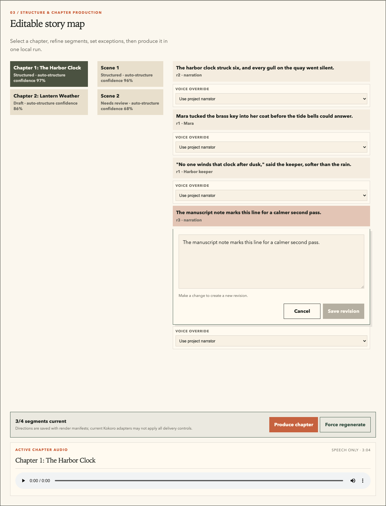
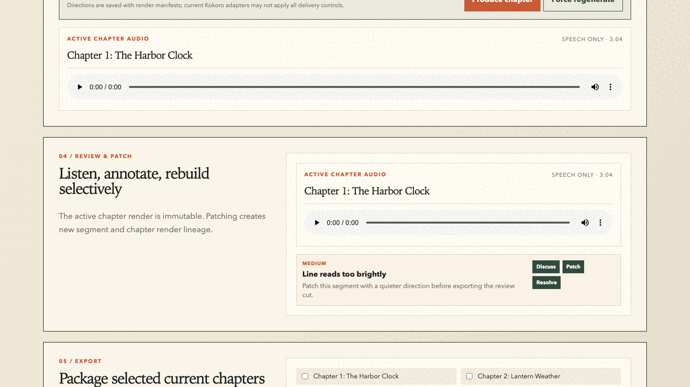

# Echodraft

**Echodraft is a local-first audiobook production desk for turning rights-cleared manuscripts into editable, patchable AI-narrated audiobook drafts.**

Unlike one-shot TTS tools, Echodraft works at segment level: import a manuscript, split it into chapters/scenes/segments, edit one line, rerender only that line, rebuild the chapter, review issues, and export a chaptered audio package.

> **Alpha software:** the dashboard currently supports the local production workflow from manuscript intake through chapter export. Expect rough edges, incomplete production controls, and evolving APIs.

---

## Why Echodraft?

Most TTS tools treat narration as a single text-to-audio job. Echodraft treats audiobook production as an editable pipeline.

| Generic TTS                   | Echodraft                                              |
| ----------------------------- | ------------------------------------------------------ |
| Paste text, get audio         | Import, structure, edit, render, review, patch, export |
| Rerender large chunks         | Rerender one segment                                   |
| Weak traceability             | Append-only render history                             |
| Audio-first                   | Manifest-driven pipeline                               |
| Cloud-oriented by default     | Local-first by default                                 |
| Hard to review long-form work | Chapter, scene, segment, issue, and export workflow    |

Echodraft is built for long-form narration where correction matters more than one-click generation.

---

## What it does

Echodraft can currently:

* create local audiobook projects with explicit rights acknowledgement;
* ingest TXT, Markdown, DOCX, EPUB, and PDF manuscripts;
* preserve source originals, PDF page metadata, clean-text decisions, canonical text, parser warnings, and import manifests;
* split manuscripts into chapters, scenes, and sentence-safe segments;
* edit individual segments with immutable revision history;
* configure narrator/voice settings through the dashboard;
* run deterministic mock TTS for pipeline validation;
* inspect and verify local tools/models in Model Center;
* set up a local Kokoro ONNX voice system from the dashboard;
* configure Piper fallback and consent-gated XTTS-v2 local provider settings;
* render missing or stale segment audio;
* assemble immutable chapter renders;
* import local WAV sound assets and assemble optional light or dramatized chapter mixes;
* run deterministic readiness QA before export;
* inspect segment review layers, leave comments, patch weak lines, and reassemble chapters;
* export selected chapters as WAV or MP3 ZIP packages with metadata, manifests, lineage, estimates, and checksums.

---

## Who is this for?

Echodraft is for:

* indie authors producing drafts from their own rights-cleared manuscripts;
* small creative teams preparing reviewable audiobook cuts;
* educators and accessibility-minded creators working with licensed or public-domain text;
* developers exploring local-first long-form audio pipelines;
* hobby/private-use creators where rights are clear.

Echodraft is **not** a fully autonomous final audiobook publisher, a SaaS production platform, a voice marketplace, or a substitute for rights clearance.

---

## Alpha status

| Area                                | Status          | Notes                                                                                      |
| ----------------------------------- | --------------- | ------------------------------------------------------------------------------------------ |
| Project creation                    | Working         | Dashboard requires rights acknowledgement                                                  |
| TXT / Markdown / DOCX / EPUB import | Working         | Local ingestion and canonical text generation                                              |
| PDF import                          | Alpha           | Page-aware text/OCR selection; scanned pages require Poppler + Tesseract English OCR        |
| Clean Text Review                   | Alpha           | Page-marker cleanup and suspicious OCR-token review before structure extraction             |
| Structure extraction                | Alpha           | Parser v2 with front matter, warnings, locks, split/merge, and segment evidence             |
| Segment editing                     | Working         | Saves new revisions instead of overwriting history                                         |
| Mock TTS                            | Working         | Silent WAVs for validating the full workflow                                               |
| Model Center                        | Alpha           | Catalog, health checks, install jobs, and OS package-manager install commands              |
| Local LLM service                   | Alpha           | Ollama model listing, schema-first extraction jobs, run records, and embeddings             |
| Managed Kokoro setup                | Alpha           | Local CPU-oriented ONNX flow from the dashboard                                            |
| TTS provider registry               | Alpha           | Mock, Kokoro, Piper fallback, and consent-gated XTTS-v2 provider contracts                  |
| Character Bible                     | Alpha           | Canonical names, aliases, traits, locks, voice links, merge/split history, and dashboard UI |
| Speaker attribution                 | Alpha           | Deterministic Cast Review rows, review locks, Ollama fallback hooks, and cast voice use     |
| Direction Studio                    | Alpha           | Segment emotions, pace/intensity, pause controls, inference, and render-stale fingerprinting |
| Render queue and compare            | Alpha           | Per-segment queue rows and latest-vs-parent render request comparison                      |
| Review and patching                 | Alpha           | Segment inspector, QA/comments, patch queue, render lineage, and chapter reassembly         |
| WAV export                          | Working         | ZIP package with metadata, source/render lineage, QA summary, estimates, and checksums      |
| MP3 export                          | Working         | Same package contract as WAV; requires FFmpeg with MP3 support                              |
| M4B export                          | Planned         | Marked as planned until a media adapter is implemented                                      |
| Sound Design                        | Alpha           | Local WAV ambience/music/SFX import, scene cue assignment, and explicit light/dramatized mixing |
| Readiness QA                        | Alpha           | Deterministic text, structure, speaker, voice, direction, audio, stale-render, and export-blocker reports |
| Cloud execution                     | Not included    | MVP is local-first                                                                         |

---

## Dashboard preview

| Project dashboard | Manuscript import |
| --- | --- |
|  |  |

| Voice setup | Segment editing |
| --- | --- |
|  |  |



---

## Workflow

```text
Create project
  → Import manuscript
  → Extract chapters, scenes, and segments
  → Edit individual segments
  → Configure narrator / voice settings
  → Produce chapter audio
  → Review issues and patch weak lines
  → Export WAV or MP3 package
```

The core design rule is simple:

> **A segment is the smallest editable, renderable, reviewable, and patchable unit.**

That means fixing one bad line should not require regenerating the whole chapter or losing previous render history.

---

## Architecture

```text
Next.js Dashboard
       |
       v
FastAPI Backend
       |
       +-- Project API
       +-- Ingestion
       +-- Structure / Narrative
       +-- Voice / Casting / Direction
       +-- TTS
       +-- Assembly
       +-- QA / Review
       +-- Export
       |
       +-- SQLite metadata
       +-- Local artifact store
       +-- Local TTS runtime
```

Echodraft separates metadata from artifacts:

* SQLite stores project metadata, structure, jobs, review state, and render records.
* The local filesystem stores source files, normalized text, manifests, WAVs, chapter renders, exports, and debug artifacts.
* Render history is append-only.
* Audio blobs are not stored in the relational database.

---

## System requirements

| Tool                | Supported baseline                        | Purpose                     |
| ------------------- | ----------------------------------------- | --------------------------- |
| Git                 | Current stable                            | Clone and contribute        |
| Python              | 3.12 recommended                          | API and pipeline services   |
| uv                  | Current stable                            | Python workspace management |
| Node.js             | 20 or later                               | Next.js dashboard           |
| npm                 | Bundled with Node.js                      | Frontend dependencies       |
| FFmpeg              | Current stable with MP3 support           | MP3 export                  |
| Poppler + Tesseract | Current stable with English language data | Scanned PDF OCR             |

Python 3.12 is the known project baseline. Newer Python versions may satisfy some metadata but can be incompatible with optional TTS packages.

---

## Quick start

Clone the repository:

```bash
git clone https://github.com/IotA-asce/echodraft.git
cd echodraft
```

Install Python and frontend dependencies:

```bash
uv python install 3.12
uv sync --python 3.12 --all-packages --group dev
npm install
cp .env.example .env
```

Start the API:

```bash
uv run --package echodraft-api uvicorn echodraft_api.main:app --reload
```

In a second terminal, start the dashboard:

```bash
npm run web:dev
```

Open:

* Dashboard: `http://localhost:3000`
* Interactive API docs: `http://localhost:8000/docs`
* API health: `http://localhost:8000/health`
* Storage readiness: `http://localhost:8000/ready`

---

## Platform setup

### Windows

Use Windows 10 or 11 and PowerShell.

Install the core tools with Windows Package Manager:

```powershell
winget install --id Git.Git -e
winget install --id Python.Python.3.12 -e
winget install --id OpenJS.NodeJS.LTS -e
winget install --id astral-sh.uv -e
winget install --id Gyan.FFmpeg -e
```

Close and reopen PowerShell, then verify:

```powershell
git --version
python --version
node --version
npm --version
uv --version
ffmpeg -version
```

Clone and install:

```powershell
git clone https://github.com/IotA-asce/echodraft.git
Set-Location echodraft

uv python install 3.12
uv sync --python 3.12 --all-packages --group dev
npm install
Copy-Item .env.example .env
```

If `python` opens the Microsoft Store, disable Python app execution aliases in Windows Settings or use `py -3.12`.

---

### macOS

Install Homebrew if needed, then run:

```bash
brew install git python@3.12 uv node ffmpeg

git clone https://github.com/IotA-asce/echodraft.git
cd echodraft

uv python install 3.12
uv sync --python 3.12 --all-packages --group dev
npm install
cp .env.example .env
```

Apple Silicon works for normal Echodraft development. Optional TTS runtimes choose their own CPU, ONNX, PyTorch, or Metal acceleration strategy.

---

### Linux

Package names vary by distribution. For Debian/Ubuntu:

```bash
sudo apt update
sudo apt install -y git curl ffmpeg

curl -LsSf https://astral.sh/uv/install.sh | sh
```

Install Node.js 20 or later from the official Node.js download page or a trusted distribution package.

Then run:

```bash
git clone https://github.com/IotA-asce/echodraft.git
cd echodraft

uv python install 3.12
uv sync --python 3.12 --all-packages --group dev
npm install
cp .env.example .env
```

For Fedora:

```bash
sudo dnf install -y git curl ffmpeg
```

---

## Configuration

The checked-in `.env.example` documents the default local paths:

```dotenv
ECHODRAFT_DATABASE_URL=sqlite:///./.echodraft/echodraft.db
ECHODRAFT_ARTIFACT_ROOT=./.echodraft/projects
ECHODRAFT_OLLAMA_BASE_URL=http://127.0.0.1:11434
NEXT_PUBLIC_API_URL=http://localhost:8000
```

Next.js reads `NEXT_PUBLIC_API_URL` from `.env`.

The API currently reads settings from the process environment. Defaults work without exporting anything, but you can override them.

PowerShell:

```powershell
$env:ECHODRAFT_DATABASE_URL = "sqlite:///./.echodraft/echodraft.db"
$env:ECHODRAFT_ARTIFACT_ROOT = ".\.echodraft\projects"
$env:ECHODRAFT_TTS_PROVIDER = "mock"
$env:ECHODRAFT_OLLAMA_BASE_URL = "http://127.0.0.1:11434"
```

Bash/zsh:

```bash
export ECHODRAFT_DATABASE_URL='sqlite:///./.echodraft/echodraft.db'
export ECHODRAFT_ARTIFACT_ROOT='./.echodraft/projects'
export ECHODRAFT_TTS_PROVIDER='mock'
export ECHODRAFT_OLLAMA_BASE_URL='http://127.0.0.1:11434'
```

Do not enter Bash-style `NAME=value` commands directly into PowerShell. Use `$env:NAME = "value"`.

---

## Running Echodraft

Start the API from the repository root:

```bash
uv run --package echodraft-api uvicorn echodraft_api.main:app --reload
```

Start the dashboard in another terminal:

```bash
npm run web:dev
```

Health checks:

PowerShell:

```powershell
Invoke-RestMethod http://localhost:8000/health
```

Linux/macOS:

```bash
curl http://localhost:8000/health
```

---

## Production workflow

### 1. Create a project

In the dashboard, enter a title and optional author, confirm that you have the rights to produce the audiobook, and select **Create project**.

Echodraft rejects projects without a declared rights status.

---

### 2. Import a manuscript

Open the project and import a `.txt`, `.md`, `.markdown`, `.docx`, `.epub`, or `.pdf` file.

Echodraft preserves the original, applies deterministic clean-text rules, creates canonical text, and reports parser warnings. Review the preview and Clean Text Review issues before continuing.

Use **Reparse** to repeat normalization from the preserved source.

For best chapter detection, use Markdown-style headings such as:

```md
## Chapter 1
```

or

```md
# Chapter 1
```

---

### 3. Extract structure

Select **Extract structure**.

Echodraft splits the manuscript into:

```text
Project
  → Chapters
    → Scenes
      → Segments
```

The default maximum segment size is 600 characters. Structure Parser v2 records evidence and warnings, supports segment locks, and lets you split or merge segments before production.

---

### Character Bible

Use **Voice bible** to maintain project cast records before production. Character records now store canonical names, aliases, traits, first-seen references, lock state, merge/split history, and optional voice links. Merge and split operations preserve traceability instead of deleting source records.

Character voice links become production inputs after Cast Review approves a segment speaker attribution.

Run **Cast Review** after structure extraction to create speaker attribution rows for every segment. Approved character attributions with voice links are used during chapter production unless a segment-level voice override is set.

---

### Direction Studio

Use **Infer directions** after structure extraction to seed segment delivery settings locally. Segment direction records store controlled emotion labels, pace, intensity, pauses, emphasis, whispering, lock state, and a direction fingerprint. Manual Direction Studio saves are locked and take effect in chapter production unless an older production override already supplies a direction.

---

### 4. Edit segments

Select a segment to open the inline multiline editor.

The editor shows:

* next revision number;
* character count;
* validation feedback;
* save/cancel controls;
* unsaved-change protection.

Keyboard shortcuts:

* `Ctrl+Enter` or `Cmd+Enter`: save a new revision
* `Esc`: cancel the edit

Saving never overwrites history. Older segment text remains available through the segment revision API.

---

### 5. Configure voices

Open **Voice setup** inside the selected project.

Use one of two modes:

| Mode                 | Use it when                                                   |
| -------------------- | ------------------------------------------------------------- |
| `mock`               | You want to validate the workflow without downloading a model |
| Kokoro managed setup | You want local spoken audio from Kokoro ONNX                  |
| Piper fallback       | You have a local Piper CLI and ONNX voice model               |
| XTTS-v2 opt-in       | You have a local Coqui runtime and consented reference WAV    |

For the first run, start with mock TTS. It creates deterministic silent WAV files so you can test ingestion, rendering, assembly, patching, and export before introducing a real model.

---

### 6. Produce chapter audio

Select a chapter and choose **Produce chapter**.

Echodraft renders only missing or stale segments, assembles a new immutable chapter render, and exposes the result in the dashboard.

Use **Force regenerate** when you intentionally want a fresh render lineage even if the source and settings are unchanged.

---

### 7. Review and patch

Use **Review & patch** to:

* inspect automated QA findings;
* leave local comments;
* resolve issues;
* patch a specific segment;
* rebuild the affected chapter.

The review loop is designed around fixing weak lines without destroying the rest of the chapter.

---

### 8. Export

Select one or more chapters under **Export** and create a WAV or MP3 ZIP package.

Each ZIP contains:

* active chapter renders;
* export manifest;
* checksum data.

M4B export is not implemented in the current alpha.

---

## TTS modes

### Mock TTS

Mock TTS is recommended for the first run.

PowerShell:

```powershell
$env:ECHODRAFT_TTS_PROVIDER = "mock"
```

Bash/zsh:

```bash
export ECHODRAFT_TTS_PROVIDER=mock
```

Mock TTS creates deterministic silent 16 kHz WAV files. It validates the production pipeline but does not produce spoken narration.

---

### Managed Kokoro setup

Real Kokoro synthesis can be set up from the dashboard.

Open **Voice setup**, choose **Kokoro managed voice system**, then select **Download and install Kokoro locally**.

The setup job handles:

* local Python runtime creation;
* package installation;
* model download;
* voice data download;
* voice list generation;
* preview validation;
* settings save.

Managed setup stores files under:

```text
.echodraft/kokoro/managed-onnx-v1
```

The current managed path is CPU-oriented. GPU/provider tuning remains out of scope for this release.

The setup job uses network access only after you select the install button. Manuscripts, generated audio, and project metadata are not uploaded.

---

### Advanced custom Kokoro adapter

The dashboard also exposes an advanced custom adapter path for users who already maintain a compatible wrapper.

Echodraft expects an executable that accepts:

```text
--model
--voices
--voice
--text
--output
```

The executable must:

1. return exit code `0` on success;
2. write a non-empty valid WAV file to `--output`;
3. use the supplied model path;
4. read a UTF-8 voice registry containing one allowed voice ID per line;
5. reject voices not present in the registry.

Echodraft never silently falls back from Kokoro to mock. If Kokoro is configured incorrectly, startup or synthesis fails with recovery guidance.

### Piper fallback and XTTS-v2 opt-in

Stage 9 adds a formal local provider registry. Piper can be configured with a local executable, ONNX model, optional config, and optional voice registry. XTTS-v2 can be configured with a local Python runtime, reference WAV, language, and explicit reference-voice consent.

Both providers fail closed when required local files or consent are missing. Echodraft does not upload text, voices, or generated audio and does not silently switch providers.

Production render fingerprints now include provider identity, synthesis text after pronunciation replacements, and applied pronunciation entries. Provider, pronunciation, voice, direction, or text changes stale only affected segment renders.

---

## PDF OCR

Text-based PDFs are extracted directly.

Scanned or image-only PDFs require local Poppler and Tesseract English OCR.

macOS:

```bash
brew install poppler tesseract
```

Debian/Ubuntu:

```bash
sudo apt install -y poppler-utils tesseract-ocr tesseract-ocr-eng
```

Windows users can install Poppler and the UB Mannheim Tesseract build, then add both executable directories to `PATH`.

```powershell
winget install --id UB-Mannheim.TesseractOCR
```

PDF OCR is local. It does not upload manuscript pages.

Current limits:

* OCR is attempted only on low-text pages;
* OCR renders pages at 200 DPI;
* imports needing OCR on more than 150 pages are rejected;
* password-protected PDFs are not supported.

---

## Local data and privacy

Default storage:

| Data                  | Default location                    |
| --------------------- | ----------------------------------- |
| SQLite metadata       | `.echodraft/echodraft.db`           |
| Project artifacts     | `.echodraft/projects`               |
| Managed Kokoro files  | `.echodraft/kokoro/managed-onnx-v1` |
| Source originals      | Project artifact directories        |
| Segment/chapter audio | Project artifact directories        |
| Exports/manifests     | Project artifact directories        |

Important rules:

* Audio binaries are never stored in the relational database.
* Source files, generated audio, manifests, and exports remain local.
* Do not edit manifests or render history by hand while the API is running.
* `test-assets/` is intentionally ignored by Git.
* Keep private manuscripts, converted PDFs, and local-only fixtures out of Git.

---

## Troubleshooting

### `uv sync` removes FastAPI or workspace packages

Recreate the environment with all workspace packages.

PowerShell:

```powershell
Remove-Item -Recurse -Force .venv
uv sync --python 3.12 --all-packages --group dev
```

Bash/zsh:

```bash
rm -rf .venv
uv sync --python 3.12 --all-packages --group dev
```

---

### PowerShell rejects `NAME=value`

Use:

```powershell
$env:NAME = "value"
```

Bash/zsh use:

```bash
export NAME=value
```

---

### Dashboard cannot reach the API

Confirm the API is running:

```bash
curl http://localhost:8000/health
```

Confirm `.env` contains:

```dotenv
NEXT_PUBLIC_API_URL=http://localhost:8000
```

Restart the dashboard after changing any `NEXT_PUBLIC_*` variable.

---

### Import or extraction appears stuck

Inspect the job endpoint:

```text
GET /api/v1/jobs/{job_id}
```

Failed jobs include `errorMessage`.

Jobs interrupted by an API restart are marked failed and should be restarted from persisted inputs.

---

### Chapter assembly fails

Every segment in the chapter must have a successful active render before the chapter can be assembled.

---

### MP3 export fails

Run:

```bash
ffmpeg -version
```

Confirm the build includes an MP3 encoder such as `libmp3lame`.

---

### Kokoro fails before synthesis

Verify:

```text
executable exists and is runnable
model path exists
voice registry exists and is UTF-8 text
requested voice ID is in the registry
wrapper writes a valid non-empty WAV
```

---

## Development

Run backend checks:

```bash
uv run pytest
uv run ruff check .
uv run mypy apps/api/src libs/domain-models/src libs/db/src
```

Run frontend checks:

```bash
npm run web:lint
npm run web:typecheck
```

Install the Playwright browser once, then run the smoke test:

```bash
npx playwright install chromium
npm run web:test:smoke
```

Check migrations against a disposable database when persistence changes.

PowerShell:

```powershell
$env:ECHODRAFT_DATABASE_URL = "sqlite:///./.tmp/echodraft-migration.db"
uv run alembic -c libs/db/alembic.ini upgrade head
Remove-Item Env:ECHODRAFT_DATABASE_URL
```

Linux/macOS:

```bash
ECHODRAFT_DATABASE_URL=sqlite:///./.tmp/echodraft-migration.db \
  uv run alembic -c libs/db/alembic.ini upgrade head
```

---

## Repository layout

| Path                 | Responsibility                                           |
| -------------------- | -------------------------------------------------------- |
| `apps/api`           | FastAPI application and pipeline services                |
| `apps/web`           | Next.js local dashboard                                  |
| `libs/domain-models` | Shared Pydantic API/domain models                        |
| `libs/db`            | SQLAlchemy repositories and Alembic migrations           |
| `docs`               | Architecture, product, API, and operating specifications |
| `plans`              | Roadmap and execution plans                              |
| `implement`          | Stage-by-stage implementation briefs                     |
| `test-assets`        | Ignored local-only fixtures; never committed             |

---

## Documentation

Start here:

1. [`docs/README.md`](docs/README.md)
2. [`docs/project-overview.md`](docs/project-overview.md)
3. [`docs/mvp-product-spec.md`](docs/mvp-product-spec.md)
4. [`docs/architecture.md`](docs/architecture.md)
5. [`docs/api-spec.yaml`](docs/api-spec.yaml)

---

## Engineering rules

* Keep changes modular and local-first.
* Preserve append-only segment and chapter render history.
* Never put audio blobs in SQLite or another relational database.
* Treat segments as the atomic editable and renderable unit.
* Update manifests whenever pipeline inputs or outputs change.
* Follow the branch, verification, commit, merge, and push workflow in [`AGENTS.md`](AGENTS.md).

---

## License

MIT License. See [`LICENSE`](LICENSE).
